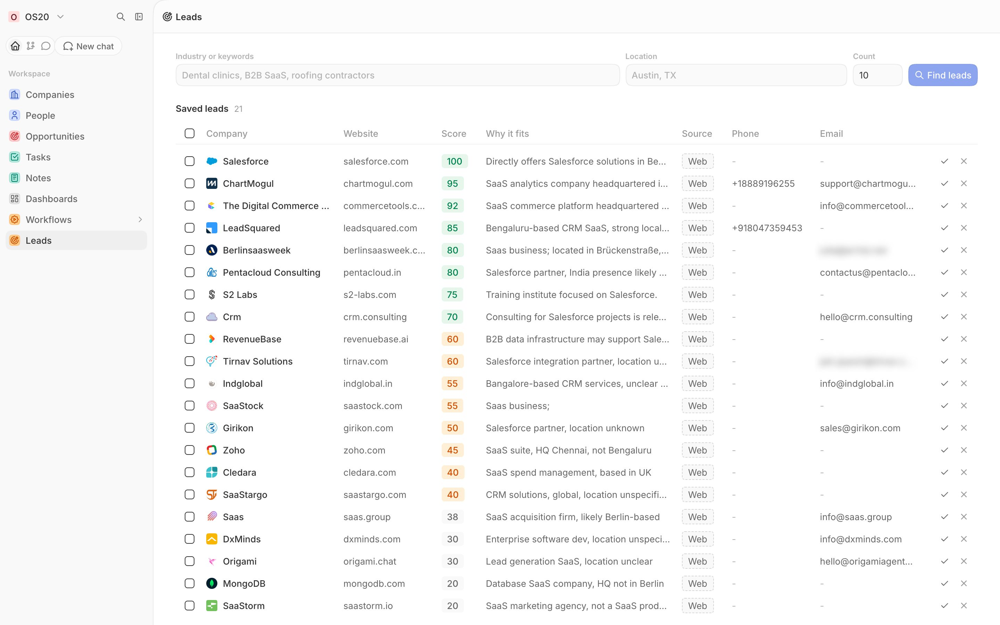
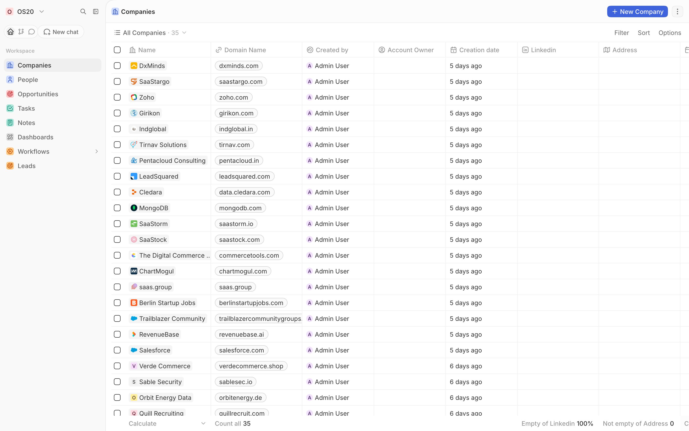
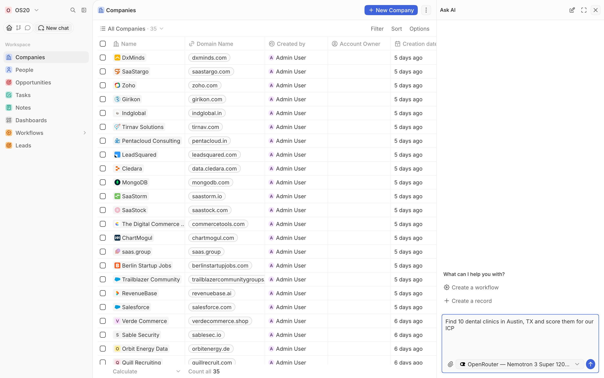
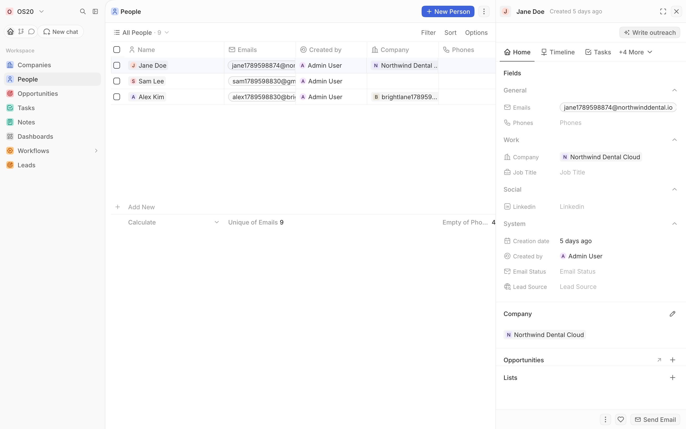
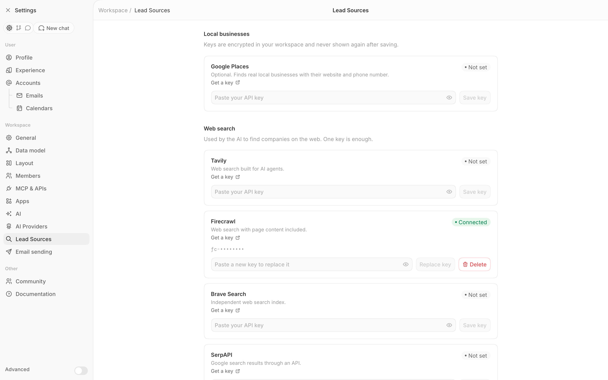

<p align="center">
  <picture>
    <source media="(prefers-color-scheme: dark)" srcset="landing/img/logo-white.svg">
    
  </picture>
</p>

<h1 align="center">OS20</h1>

<p align="center"><strong>The open source CRM that finds its own leads, running on your computer.</strong></p>

<p align="center">
  <a href="LICENSE"></a>
  <a href="https://github.com/omyvnss/os20/releases"></a>
  
  <a href="https://www.npmjs.com/package/os20-cli"></a>
</p>

<p align="center">
  <a href="https://os20.git11.xyz">Website</a> ·
  <a href="https://github.com/omyvnss/os20/releases">Releases</a> ·
  <a href="docs/ARCHITECTURE.md">Docs</a> ·
  <a href="https://os20.git11.xyz/#faq">FAQ</a>
</p>

<p align="center">
  
</p>

## What it does

- **A full CRM.** Companies, People, Opportunities, Tasks, Notes, custom objects, views, filters and workflows, plus a GraphQL and REST API.
- **An AI lead engine.** Describe who you sell to. OS20 searches the web (and optionally Google Places), scores every company 0 to 100 against your ideal customer, explains why, and saves the leads to your CRM.
- **Ask AI.** A chat agent that can search your records, find leads and create records for you.
- **Outreach.** Write a personalised first message for any person with one click, then send it from your own email account.
- **Email checks.** DNS MX and SMTP checks mark each email as verified, deliverable or unknown before you write to it.
- **Your keys, your computer.** Bring your own AI and search keys. Everything runs in Docker on your machine, with no account and no login.

## Quick start

You need [Docker Desktop](https://docs.docker.com/get-docker/) (macOS, Windows) or Docker Engine (Linux).

**With npm** (needs Node.js 18+ and Git):

```bash
npx os20-cli
```

**With curl** (no Node.js needed):

```bash
curl -fsSL https://raw.githubusercontent.com/omyvnss/os20/main/install.sh | bash
```

Both generate local secrets in `~/.os20/.env`, pull the prebuilt images from GitHub Container Registry and start OS20. Then open <http://localhost:3010> and click **Open OS20**. First boot takes a few minutes while the database is set up.

<details>
<summary>Run with Docker Compose only</summary>

```bash
git clone https://github.com/omyvnss/os20.git
cd os20
printf 'APP_SECRET=%s\nPGDB_ENCRYPTION_KEY=%s\nOS20_LEADGEN_TOKEN=%s\n' \
  "$(openssl rand -hex 32)" "$(openssl rand -hex 32)" "$(openssl rand -hex 32)" > .env
docker compose up -d
```

Keep `.env` safe. `APP_SECRET` encrypts the API keys you save, so changing it later makes them unreadable.

</details>

| Service | Purpose | Address |
|---|---|---|
| OS20 | CRM web app and API | `127.0.0.1:3010` |
| OS20 worker | Background jobs (Ask AI, workflows) | internal |
| Lead engine | Company scraping, scoring, email checks | `127.0.0.1:8120` |
| PostgreSQL | Database | `127.0.0.1:5433` |
| Redis | Cache and job queue | `127.0.0.1:6380` |

## Screenshots

<table>
  <tr>
    <td width="50%"><br><sub><b>Companies.</b> Every lead you keep becomes a real CRM record.</sub></td>
    <td width="50%"><br><sub><b>Ask AI.</b> Ask for leads in plain words, with the model you choose.</sub></td>
  </tr>
  <tr>
    <td width="50%"><br><sub><b>Write outreach.</b> A first message for any person, one click away.</sub></td>
    <td width="50%"><br><sub><b>Lead Sources.</b> Add a search key once. Saved keys are encrypted and masked.</sub></td>
  </tr>
</table>

## Bring your own keys

OS20 has no paid plan and no hosted AI. Add keys in **Settings > AI Providers** and **Settings > Lead Sources**. Keys are encrypted with your `APP_SECRET`, stored in your local database and never shown again after saving.

| Kind | Provider | Notes |
|---|---|---|
| AI | [OpenRouter](https://openrouter.ai) | One key for many models, including free ones |
| AI | OpenAI | |
| AI | Anthropic | |
| AI | Google Gemini | |
| AI | Groq | |
| AI | Mistral | Through OpenRouter |
| AI | Ollama | Local models, no key. Reached at `host.docker.internal:11434`. On Linux start Ollama with `OLLAMA_HOST=0.0.0.0` |
| Web search | Tavily | One search key is enough |
| Web search | Firecrawl | Includes page content |
| Web search | Brave Search | |
| Web search | SerpAPI | Google results |
| Local businesses | Google Places | Optional. Real local businesses with website and phone number |

Without an AI key, lead scoring falls back to a simple heuristic score.

## Commands

The CLI is `os20-cli` on npm. Run any command with `npx os20-cli <command>`, or install it once with `npm install -g os20-cli` and use `os20 <command>`.

| Command | What it does |
|---|---|
| `os20` or `os20 start` | Start OS20 and open the browser |
| `os20 stop` | Stop OS20 |
| `os20 status` | Show running services |
| `os20 logs` | Show logs (`-f` to follow) |
| `os20 update` | Back up the database, then pull the latest version |
| `os20 backup` | Save a backup now |
| `os20 restore <file>` | Restore a backup file |
| `os20 reset` | Delete all data and start fresh |

## How updates work

- **Update notice.** When a new release is out, OS20 shows an "update available" banner and the current version under **Settings > Community**.
- **Update.** Run `os20 update`. If you installed with curl, run the install command again.
- **Automatic backups.** Both update paths save a database backup to `~/.os20/backups/` first and keep the last 5. Your data lives in Docker volumes and survives updates.
- **Restore.** If something goes wrong, run `os20 restore ~/.os20/backups/<file>.sql.gz`.

## Privacy

- **Runs on your computer.** Your CRM data stays in a Docker volume on your machine.
- **Local only by default.** Every port is published on `127.0.0.1`, so other devices on your network cannot reach it.
- **No telemetry by default.** Usage telemetry is turned off.
- **Update check only fetches the version.** OS20 asks the GitHub Releases API for the latest version at most every 12 hours. Nothing about you or your data is sent. Turn it off with `OS20_UPDATE_CHECK=false` in `~/.os20/.env`.
- **AI and search calls go straight to the provider you pick**, using your key. Use Ollama if you want AI that never leaves your machine.

<details>
<summary>Running on a server (VPS, EC2)</summary>

OS20 has no login screen, so never open port 3010 to the internet.

- **Just you:** tunnel over SSH, then open <http://localhost:3010>.
  ```bash
  ssh -L 3010:127.0.0.1:3010 you@your-server
  ```
- **A team on a domain:** put a reverse proxy in front that requires its own login (for example Caddy `basic_auth`), proxy to `127.0.0.1:3010`, and add to `~/.os20/.env`:
  ```bash
  OS20_SERVER_URL=https://crm.example.com
  OS20_ALLOWED_HOSTS=crm.example.com
  ```
- **Workflow HTTP steps** block private and host addresses by default. To call services such as n8n on your network, set `OUTBOUND_HTTP_SAFE_MODE_ENABLED=false`.

</details>

## FAQ

Common questions (what you need to run it, whether it is free, where your data is stored, which AI models and search APIs work, whether you need to sign up) are answered at [os20.git11.xyz/#faq](https://os20.git11.xyz/#faq).

## Contributing

Issues and pull requests are welcome. Read [docs/DEVELOPMENT.md](docs/DEVELOPMENT.md) to build and run OS20 from source, and [docs/ARCHITECTURE.md](docs/ARCHITECTURE.md) for how the pieces fit. Please never include real API keys or `.env` files in issues or pull requests.

## Credits

- Lead enrichment is built on **[Scout](https://github.com/kiryano/Scout)** (MIT).
- AI extraction uses **[ScrapeGraphAI](https://github.com/ScrapeGraphAI/Scrapegraph-AI)** (MIT). It is optional and not included in the default lead engine image.
- The CRM core is a fork of an AGPL-3.0 open source CRM.

## License

OS20 is licensed under [AGPL-3.0](LICENSE). The lead engine, Scout and ScrapeGraphAI are MIT.

---

<p align="center">Built by <a href="https://omyvnss.xyz">Om Yaduvanshi</a></p>
